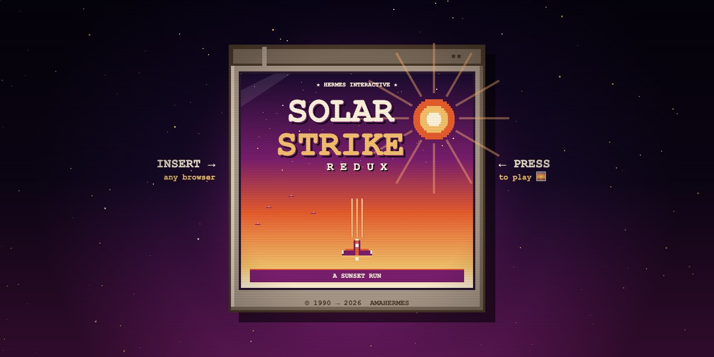

# Solar Strike Redux 🌅🚀

A modern, colorized homage to **Solar Striker** (Game Boy, 1990) — a vertical-scrolling shoot-'em-up. Built with p5.js so it runs in any browser.

### ▶️ [**Play it in your browser →**](https://amahermes.github.io/solar-strike-redux/)

## Project Owner
- **Razz** (creative direction)
- **Hermes** (implementation)

## Vision
Faithful to the *feel* of Solar Striker — tight controls, wave-based alien fighters, 6 stages with bosses, chiptune soundtrack — but reimagined in color with a "solar sunset" palette and modern game-feel polish (screenshake, particles, juicy hit feedback).

## Current Status
**Phase 0 — Design & Scaffolding** (in progress)

## Quick Start
Open `src/index.html` in a browser. That's it — no build step.

## Files
- `docs/DESIGN.md` — the living game design doc
- `docs/ROADMAP.md` — phased milestones (v0.1 → v1.0)
- `docs/SESSION_LOG.md` — what we did each session, so we never lose our place
- `src/` — the game itself (p5.js)
- `assets/` — sprites, sounds, music (will populate as we go)

## How We Work
At the end of each session, Hermes updates `SESSION_LOG.md` with what was built, what's next, and any open questions. At the start of the next session, just say "load solar strike" and we pick up where we left off.
